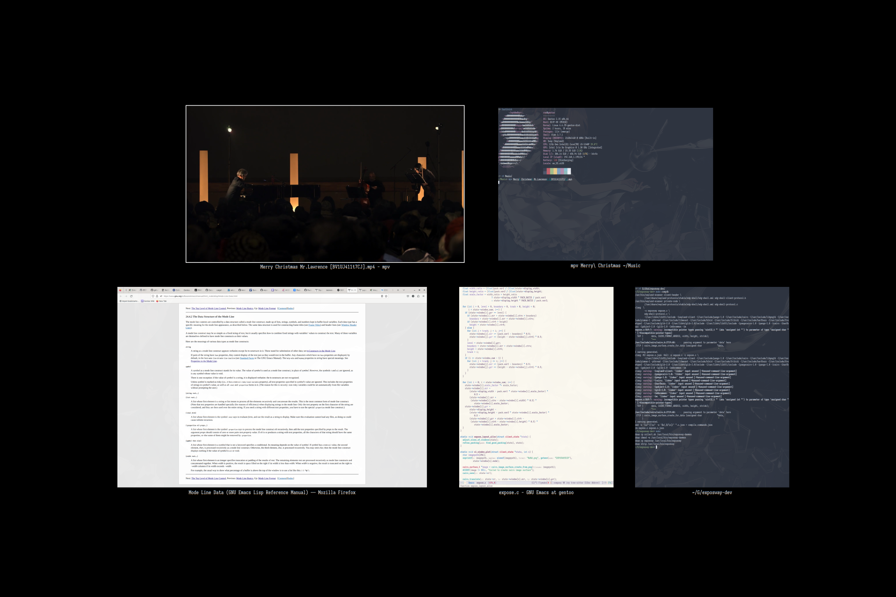

# Exposé your SwayWM


<p align="center">
  MacOS X Exposé reimplemented.
</p>

## Status

Stable. Probably no more features will be added.

## Introduction

Exposway brings the MacOS X Exposé functionality to the Sway window manager,
allowing you to overview all windows and navigate to your desired one.
This feature is similar to:

- MacOS Mission Control
- Gnome Activities Overview
- KDE Present Windows

It's implemented in pure C with minimal dependencies.

## Installation

Currently, you need to compile Exposway from source.

### Dependencies

You need the following dependencies:

- `cairo` for interface drawing
- `pango` for font rendering
- `grim` for taking snapshots

### Make

Clone the repository locally and run `make` to generate the executable.
By default, `clang` is used as the compiler.
To use a different compiler, you can specify it like this:

```shell
make CC=gcc
```

Next, install the binary to your `$PATH` by `make install`.
The default installation prefix is `/usr/local`.
To change this, use:

```shell
make PREFIX=/usr install
```

### Configuration

There are two curcial enviroment variables that needs to be set properly.

```shell
export EXPOSWAYDIR="$HOME/.local/state/exposway/"
export EXPOSWAYMON="$EXPOSWAYDIR/output"
```

You should launch `exposwayd` as a daemon at boot.
To trigger Exposé, run `exposway`.
For example, add the following to your Sway configuration file:

```shell
exec exposwayd
bindsym $mod+z exec exposway
```

## Usage

After pressing the designated shortcut key or executing `exposway`, you will enter Exposé mode.
The following keys are supported:

- the arrow keys, to change focus between windows
- `space`, to navigate to the currently focused window
- `esc`, do nothing and exit

## Misc

### Customization

Edit the source files `expose.c` and `exposed.c` directly. If unsure, feel free to open an issue.

### Troubleshoot

Launch `exposwayd` with the log option `-l`, the log is located at `$EXPOSWAYDIR/expose.log`.

### Static analysis

Simply run `make analysis` will do. Clang/LLVM toolchain is needed for this.

### Contribution

Please adhere to the `LLVM` coding style. If you use clangd as LSP, `make compdb` will generate the `compile_commands.json` for you.
